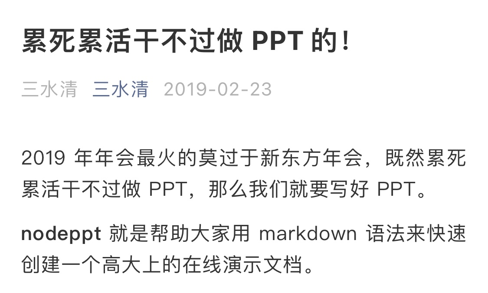
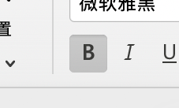
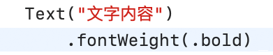
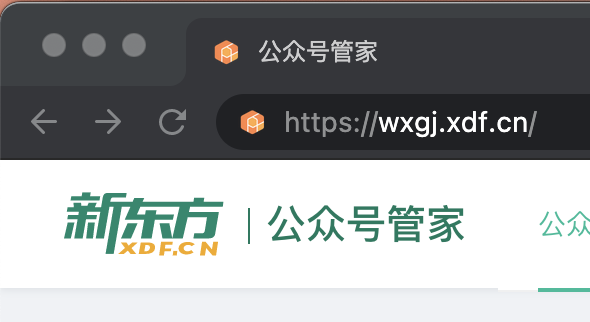
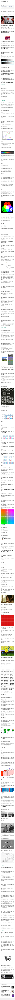
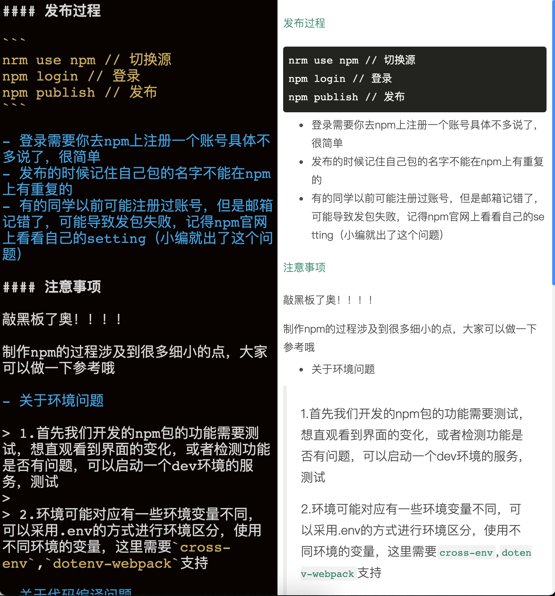
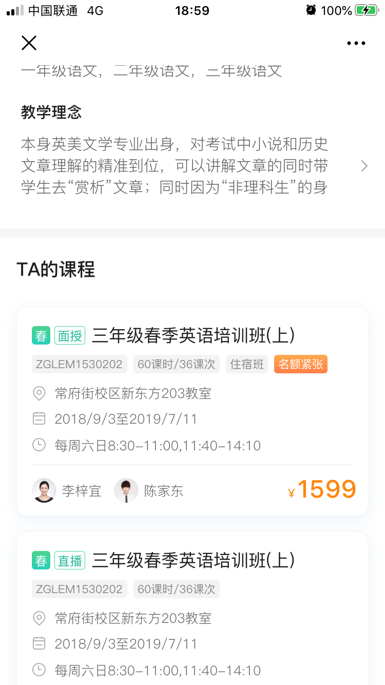
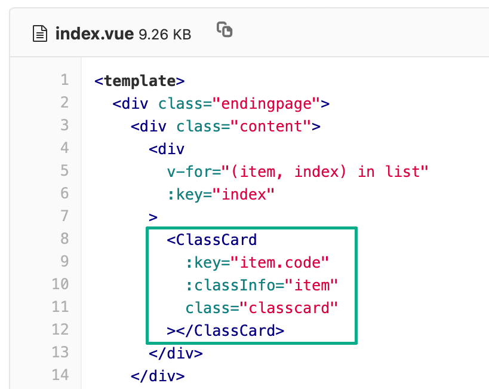
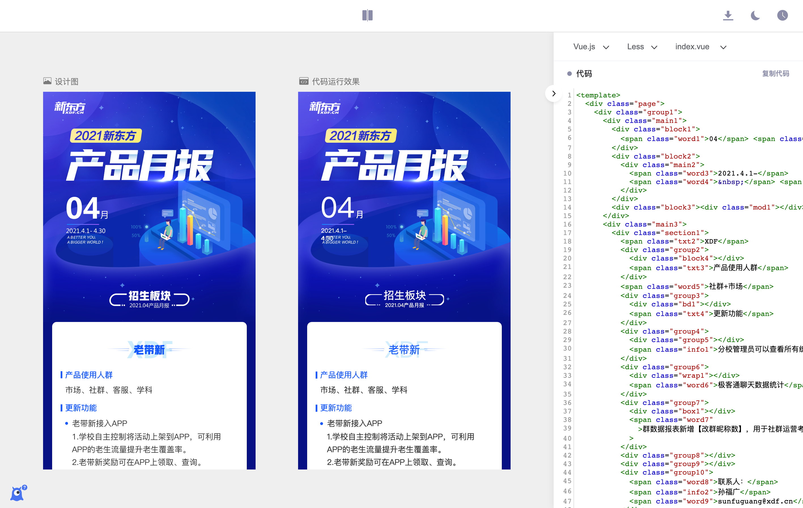
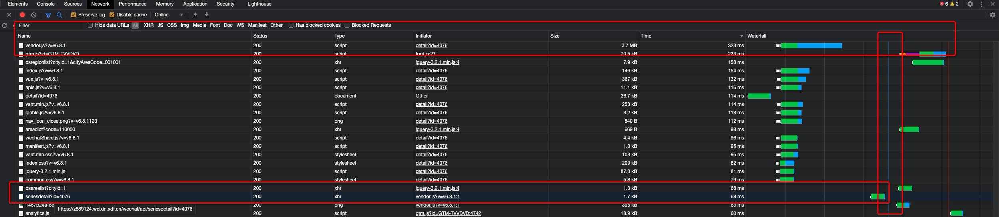

# <!--fit--> 2021财年年度述职报告

姓名 费照君

日期 2021年5月28日

<style scoped>
section {
  background: #00896c url(../assets/bg-index.png) repeat-x left bottom;
  background-size: auto 27%;
  color: #fff;
}
h1 {
  width: 500px;
  margin: 150px auto 140px;
  font-size: 72px;
  color: #fff;
  text-align: center;
}
p {
  text-align: left;
  width: 340px;
  font-size: 28px;
  margin: 10px auto;
  text-align: center;
}
footer {
  background: url(./assets/slogan-index.png) no-repeat 36px bottom;
  background-size: auto 62px;
}
</style>

<!-- This is presenter note. You can write down notes through HTML comment. -->

---

## 

## Markdown → PPT → pdf → pptx

下面就是我完成这页PPT的代码：

```
## 

## Markdown → PPT → pdf → pptx

下面就是我完成这页PPT的代码：

```

---


# nodeppt

##  → 为什么要用MD写PPT？

<style scoped>
  h2 img {
    border: 1px solid #e0e0e0;
    vertical-align: middle;
  }
</style>

---

# 为什么用 Markdown

## 　　VS　　

## ↑　　　　　　　　　　　　　↑　　.
##   　　　　　　　　　　LaTeX　　　　.

## ~~FrontPage~~

<style scoped>
  h2 img {
    vertical-align: middle;
  }
</style>

---

# markdown-it

## 　&　

---

# markdown-it

##   

<style scoped>
  h2 img {
    float: left;
  }
  h2 img:nth-child(1) {
    margin-left: 400px;
    margin-right: 40px;
  }
  h2 img:nth-child(3) {
    margin-left: 100px;
  }
</style>

---

# 团队情况

项目 | 人数
---|---
小课堂 极客通 | 2
电商 官网 | 4
公众号管家 资料库 | 2
乐词 乐听说 | 2
总计 | 9
离职 | 4

<style scoped>
  tr:last-child td {
    color: #999;
  }
</style>
---

# 团队情况

## 前端开发在项目中权重增加

- 资料库
- 内容站改版
- 小表单
- 渠道管理……

<style scoped>
  tr:last-child td {
    color: #999;
  }
</style>

---

# 精进开发效率

```
npm install @xdf/design
```

<style scoped>
  pre {
    text-align: center;
    background: #fff;
    color: #000;
    margin-top: 100px;
  }
</style>

---

# 精进开发效率

##    

---

# 精进开发效率

## 高度复用的UI类组件

##  → 

## 搭课：一行代码UI实现

---

# 精进开发效率

## 探索新的效率工具

## 

调研报告：http://confluence.staff.xdf.cn/pages/viewpage.action?pageId=374768364

<style scoped>
  p {
    font-size: 22px;
  }
</style>

---

# 精进技术建设

- 2020.10 Node服务上线
- 2020.6 Nuxt项目上线
- 统一后台UI规范
- 接入sls用户端错误跟踪
- 尝试参与开源项目
- ……

---

# 精进用户体验

## 配合交互设计师，实现他们的想法


  <div class="loading">
    <div class="icon-loading">
      <svg viewBox="0 0 120 120">
        <circle cx="60" cy="60" r="50" />
        <circle cx="60" cy="60" r="50" />
        <circle cx="60" cy="60" r="50" />
      </svg>
    </div>
    <div class="text">
      正在登录
    </div>
  </div>

<style scoped>
  @keyframes part1 {
    0% {
      stroke-dasharray: 157, 157;
      stroke-dashoffset: 0;
    }
    20% {
      stroke-dasharray: 157, 157;
      stroke-dashoffset: 0;
    }
    50% {
      stroke-dasharray: 236, 78;
      stroke-dashoffset: -314;
    }
    80% {
      stroke-dasharray: 157, 157;
      stroke-dashoffset: -628.1;
    }
    100% {
      stroke-dasharray: 157, 157;
      stroke-dashoffset: -628.1;
    }
  }
  @keyframes part2 {
    0% {
      stroke-dashoffset: -188;
      stroke-width: 16;
    }
    20% {
      stroke-dashoffset: -188;
      stroke-width: 16;
    }
    26% {
      stroke-dashoffset: -220;
      stroke-width: 0;
    }
    78% {
      stroke-dashoffset: -474;
      stroke-width: 0;
    }
    80% {
      stroke-dashoffset: -502;
      stroke-width: 16;
    }
    100% {
      stroke-dashoffset: -502;
      stroke-width: 16;
    }
  }
  @keyframes part3 {
    0% {
      stroke-dashoffset: -282;
      stroke-width: 16;
    }
    20% {
      stroke-dashoffset: -282;
      stroke-width: 16;
    }
    32% {
      stroke-dashoffset: -314;
      stroke-width: 16;
    }
    34% {
      stroke-dashoffset: -314;
      stroke-width: 0;
    }
    70% {
      stroke-dashoffset: -444;
      stroke-width: 0;
    }
    72% {
      stroke-dashoffset: -444;
      stroke-width: 16;
    }
    80% {
      stroke-dashoffset: -596.1;
      stroke-width: 16;
    }
    100% {
      stroke-dashoffset: -596.1;
      stroke-width: 16;
    }
  }
  .loading {
    position: fixed;
    top: 50%;
    left: 50%;
    transform: translate(-50%, -50%);
    margin-top: -20px;
  }
  .loading .icon-loading {
    width: 80px;
    height: 80px;
    margin: 0 auto 40px;
  }
  .loading .icon-loading svg {
    width: 100%;
    height: 100%;
  }
  .loading .icon-loading svg circle {
    stroke-linecap: round;
    stroke: #1fb895;
    stroke-width: 10;
    fill: none;
  }
  .loading .icon-loading svg circle:nth-child(1) {
    animation: part1 2s linear infinite;
  }
  .loading .icon-loading svg circle:nth-child(2) {
    stroke-width: 16;
    stroke-dasharray: 0, 314;
    animation: part2 2s linear infinite;
  }
  .loading .icon-loading svg circle:nth-child(3) {
    stroke-width: 16;
    stroke-dasharray: 0, 314;
    animation: part3 2s linear infinite;
  }
  .loading .text {
    font-size: 24px;
    height: 40px;
    line-height: 40px;
    color: #bcbcbc;
    font-family: PingFangSC-light,sans-serif;
    font-weight: 300;
    text-align: center;
  }
</style>

---

# 精进用户体验

## 小课堂微信端优化



主页 index.js 减少为 → 2.2KB

---

# 年终总结

## 有负众望 

## 吃力地完成任务

<style scoped
  h2 {
    font-size: 72px;
  }
</style>

---

### 谢谢大家！

####  也不知道这个PPT模板在最后一页放这个东西是要大家写什么

<style scoped>
  h3{
    text-align: right;
    font-size: 110px;
    padding-top: 100px;
    color: #fff;
  }
  h4 {
    color: #00896c;
    font-size: 32px;
    width: 360px;
    margin-left: 230px;
    margin-top: -260px;
  }
  h4 img {
    display: block;
    margin: 0 auto 20px;
  }
  section {
    background: #00896c url(./assets/bg-end.png) no-repeat center bottom;
    background-size: 100% auto;
  }
  footer {
    background-image: url(./assets/slogan-index.png);
    background-size: auto 64px;
  }
</style>